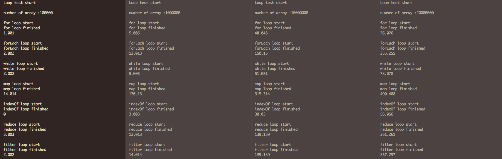

# What do you think the fastest javascript way to loop array is?  

There's few ways to loop array, like for, while, forEach and more. But, i have never thought about what is the best?  
Yeah, i know there's no always best way to loop. People can use it according to purpose that each method made for.  
But, some people(like me) want to know the speed. How fast they go for result?  
So, i made this "mythbusters" project.  

This is the plan!  

1. Make one array that have 100000, 1000000, 10000000, 20000000 elements of string.
2. Let each method do a one string compare(like if(someArray[count] === string) this form) in the each loop.
3. Check the time they use for loop.
4. compare it.

Simple and easy.

# Result  

## Full array loop
  
One thing we have to consider is, few seconds(1~2sec in 100000 and 1000000 array length, 10~20sec in 10000000 and 20000000 array length) can be affected by envirenment. it means, this result is just sample and not always same.  

What result show.  

1. for and while loop use similar way to loop. forEach, reduce and filter are also similar. map and indexOf use each different way.
2. map is slower than others.
3. indexOf is faster than others.

It looks interesting!  

Actually, we already know why map, forEach, reduce and filter are slow. Threse four method use function to loop. Calling function need more time than for or while. Even map, map have to make whole array(same with base array) to run the cycle. As a result, for, while and indexOf are the fastest array loop method.  
So, can this result make any meaningful changes?  

# But...  

Unfortunately, answer is NO.  

Javascript engine do the JIT compile when loop or function called too many time. It make loop as machine code or more effcient. Eventually, loop depends on JS engine and there's no meaning in the time result. What make slow or fast is the time complexity, not loop and running time. So, the point is, answer of "what should we use for loop?" is "by their own purpose."  

I know this is not a funny end, but test result is pretty funny. I think i can choose one when i need to do long array loop.  